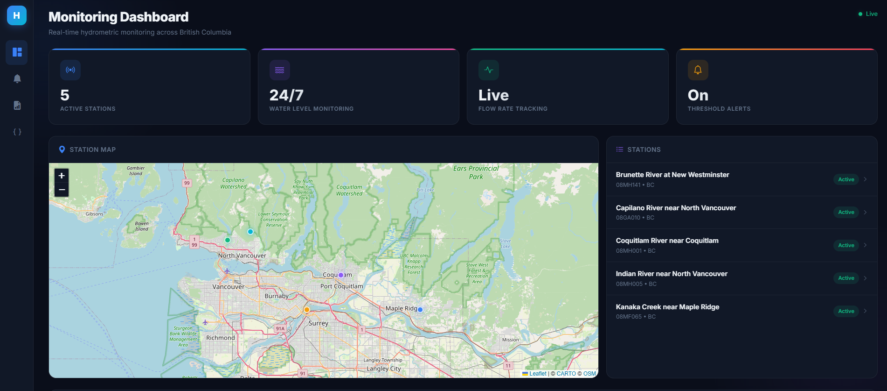
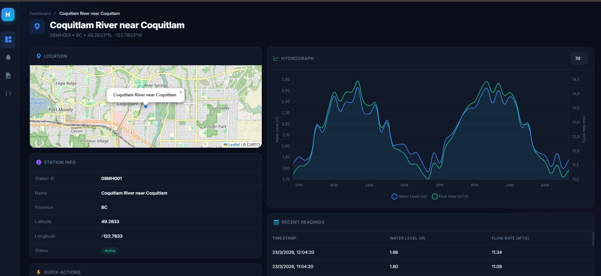
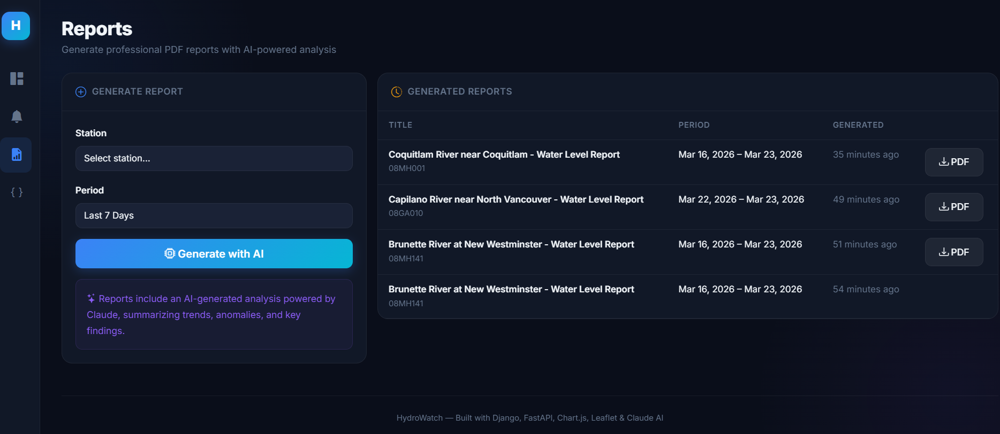
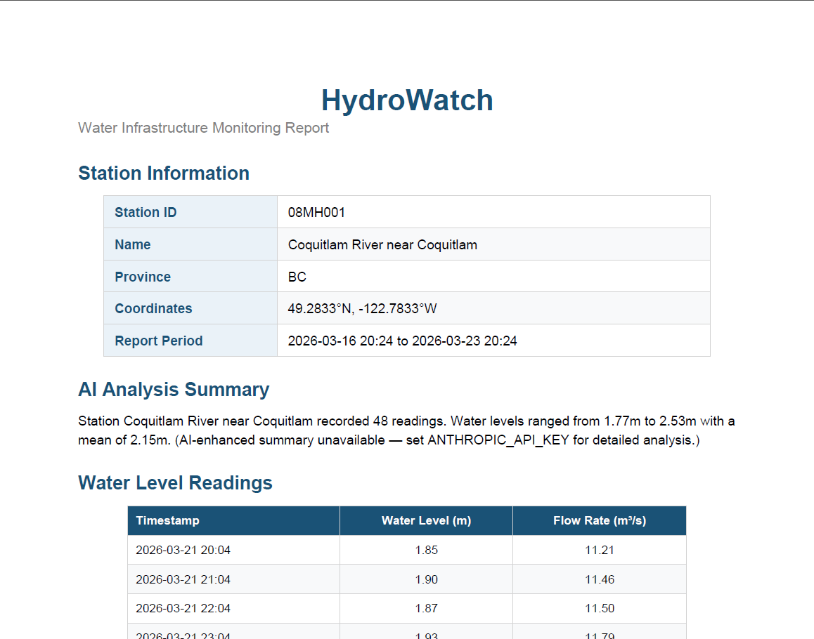
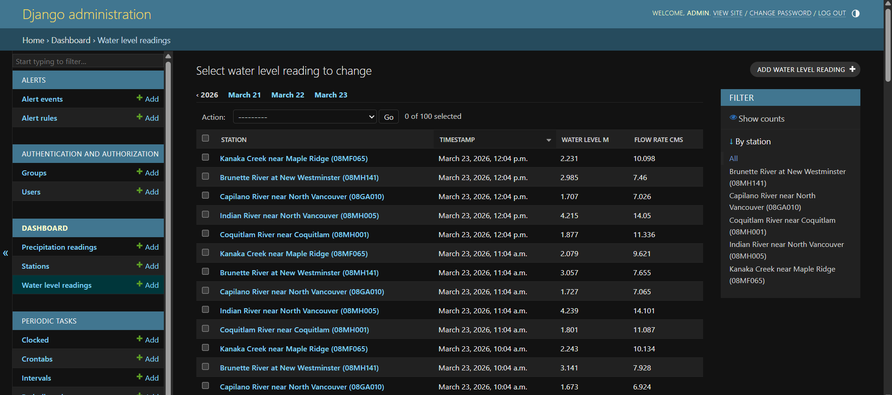

# HydroWatch

**Water Infrastructure Monitoring Dashboard**

A full-stack platform for ingesting, visualizing, and analyzing real-time hydrometric data across British Columbia. Features interactive maps, dual-axis hydrographs, AI-powered report generation, threshold-based alerting, and professional PDF output — all orchestrated as a Dockerized microservices architecture.


---

## Architecture

```
┌─────────────┐     ┌──────────────────┐     ┌────────────────────┐
│   Browser    │────▶│     Nginx :80    │────▶│   Django :8000     │
│              │     │  (reverse proxy) │     │  (Dashboard, API,  │
│  Leaflet.js  │     └──────┬───────────┘     │   Reports, Alerts) │
│  Chart.js    │            │                 └────────┬───────────┘
│  Bootstrap 5 │            │                          │
└─────────────┘            │                          ▼
                            ▼                 ┌────────────────┐
                   ┌────────────────┐         │ Celery Worker  │
                   │ FastAPI :8001  │         │ + Beat         │
                   │ (Ingestion     │         │ (Scheduled     │
                   │  Microservice) │         │  Ingestion &   │
                   └───────┬────────┘         │  Alert Eval)   │
                           │                  └───────┬────────┘
                           ▼                          │
                   ┌────────────────┐                 ▼
                   │  External APIs │         ┌────────────────┐
                   │  (Environment  │         │    Redis       │
                   │   Canada       │         │  (Task Broker) │
                   │   Hydrometric) │         └────────────────┘
                   └────────────────┘
                                              ┌────────────────┐
                   ┌────────────────┐         │  Claude API    │
                   │  PostgreSQL    │         │  (Anthropic)   │
                   │  + PostGIS     │         │  AI-Powered    │
                   │  (Data Store)  │         │  Summaries     │
                   └────────────────┘         └────────────────┘
```

## Tech Stack

| Layer | Technology | Purpose |
|-------|-----------|---------|
| **Backend** | Django 5.1 + Django REST Framework | Dashboard, admin panel, REST API |
| **Microservice** | FastAPI + Uvicorn | Data ingestion from third-party APIs |
| **Database** | PostgreSQL 16 + PostGIS | Geospatial data storage with GIS support |
| **Task Queue** | Celery + Redis | Scheduled data ingestion, alert evaluation |
| **Frontend** | Leaflet.js, Chart.js, Bootstrap 5 | Interactive maps, time-series charts, dark-themed UI |
| **PDF Reports** | ReportLab | Professional branded client-ready PDF generation |
| **AI** | Anthropic Claude API (Sonnet) | Natural-language hydrological analysis summaries |
| **Deployment** | Docker Compose (7 containers), Nginx | Production-ready containerized multi-service orchestration |
| **Version Control** | Git with conventional commits | Clean commit history and changelog-ready messages |

## Features

### 1. Interactive Dashboard
- Dark-themed modern UI with glassmorphism cards, sidebar navigation, and bento grid layout
- Leaflet.js map with OpenStreetMap tiles showing 5 BC monitoring stations
- Hover-to-pan: station list items fly the map to the corresponding marker
- Fully responsive — sidebar collapses to bottom nav on mobile

### 2. Data Visualization
- Chart.js dual-axis hydrographs (water level + flow rate on separate Y-axes)
- Configurable time ranges: 24h, 7d, 30d, 90d
- Smooth bezier curves with translucent fill areas
- Dark-themed tooltips and legends
- Tabular data view with the 50 most recent readings

### 3. Data Ingestion Pipeline
- **FastAPI microservice** fetches real-time data from Environment Canada's Hydrometric CSV API
- Celery Beat schedules hourly ingestion across all stations
- Deterministic synthetic fallback data for demo/offline mode (seeded by station ID)
- Django management command (`python manage.py seed_data`) for manual seeding
- OpenAPI/Swagger docs at `/docs` for the ingestion API

### 4. Threshold Alerts
- User-configurable alert rules: select station, metric, operator, threshold, and email
- Automatic evaluation after each ingestion cycle via Celery task chaining
- Email notifications with 1-hour cooldown to prevent spam
- Alert event history log with timestamps

### 5. AI-Powered Reports
- **Claude API (Anthropic Sonnet)** generates natural-language analysis of water level trends
- Prompt includes statistical summary, min/max/mean/stdev, recent trend direction
- Professional PDF reports with ReportLab: branded header, station info table, AI summary, data table
- Graceful fallback to statistical summary when API key is unavailable or credits are exhausted

### 6. RESTful API
- Full Django REST Framework API at `/api/` with browsable HTML interface
- Endpoints: `stations`, `readings`, `alerts`, `alert-events`, `reports`
- Nested actions: `/api/stations/{id}/readings/`, `/api/stations/{id}/precipitation/`
- Pagination, filtering, and JSON/HTML renderers
- FastAPI ingestion service with separate OpenAPI docs at `/docs`

## Screenshots

### Dashboard


### Station Detail — Hydrograph & Readings


### Reports — AI-Powered PDF Generation


### PDF Report Output


### Django Admin Panel


## Quick Start

### Prerequisites
- **Docker** & **Docker Compose** (v2+)
- (Optional) [Anthropic API key](https://console.anthropic.com/settings/keys) for AI-powered report summaries

### Setup

```bash
# 1. Clone the repository
git clone https://github.com/YOUR_USERNAME/hydrowatch.git
cd hydrowatch

# 2. Configure environment
cp .env.example .env
# Edit .env — add your ANTHROPIC_API_KEY and change DJANGO_SECRET_KEY

# 3. Start all services (7 containers)
docker compose up --build -d

# 4. Seed demo data (5 BC stations + 240 hourly readings)
docker compose exec django python manage.py seed_data

# 5. Create admin user
docker compose exec django python manage.py createsuperuser
```

### Access

| Service | URL | Description |
|---------|-----|-------------|
| **Dashboard** | http://localhost | Main monitoring interface |
| **Django Admin** | http://localhost/admin/ | Database management |
| **REST API** | http://localhost/api/ | Browsable DRF API |
| **Ingestion Docs** | http://localhost/docs | FastAPI Swagger UI (proxied via Nginx) |

## Project Structure

```
hydrowatch/
├── docker-compose.yml              # 7-service orchestration (Django, FastAPI, Celery, Redis, PostgreSQL, Nginx)
├── .env.example                    # Environment variable template
├── .gitignore
│
├── django_app/                     # Django project
│   ├── Dockerfile
│   ├── requirements.txt
│   ├── manage.py
│   ├── hydrowatch/                 # Project config
│   │   ├── settings.py             # Django settings (DB, Celery, CORS, DRF, etc.)
│   │   ├── celery.py               # Celery app configuration
│   │   ├── urls.py                 # Root URL routing
│   │   └── wsgi.py
│   ├── dashboard/                  # Core dashboard app
│   │   ├── models.py               # Station, WaterLevelReading, PrecipitationReading
│   │   ├── views.py                # Dashboard views + chart data JSON endpoint
│   │   ├── tasks.py                # Celery tasks: ingest_all_stations, evaluate_alerts
│   │   ├── admin.py                # Django admin registration
│   │   ├── templates/dashboard/    # Base template, index, station detail, report list
│   │   ├── templatetags/           # Custom |to_json filter for GeoJSON
│   │   └── management/commands/    # seed_data management command
│   ├── alerts/                     # Alert engine
│   │   ├── models.py               # AlertRule (with evaluate()), AlertEvent
│   │   ├── forms.py                # AlertRuleForm (Django ModelForm)
│   │   ├── views.py                # CRUD views for alert rules
│   │   └── templates/alerts/       # List, create, confirm delete templates
│   ├── reports/                    # PDF report generation
│   │   ├── models.py               # Report model (with FileField for PDF storage)
│   │   ├── summarizer.py           # Claude API integration + fallback statistics
│   │   ├── pdf_generator.py        # ReportLab PDF builder (branded, tabular)
│   │   └── views.py                # Generate + download views
│   └── api/                        # REST API
│       ├── serializers.py          # DRF ModelSerializers for all models
│       ├── views.py                # ViewSets with custom actions
│       └── urls.py                 # DefaultRouter configuration
│
├── ingestion_service/              # FastAPI microservice
│   ├── Dockerfile
│   ├── requirements.txt
│   ├── main.py                     # Endpoints: /ingest/stations, /ingest/readings/{id}, /ingest/all
│   └── config.py                   # Pydantic settings (DATABASE_URL)
│
├── ai_service/                     # AI integration (standalone module)
│   └── summarizer.py               # Claude API client (also copied into django_app/reports/)
│
└── nginx/
    └── nginx.conf                  # Reverse proxy: / → Django, /ingest/ → FastAPI
```

## Development

```bash
# View logs for all services
docker compose logs -f

# View Django logs only
docker compose logs -f django

# Django shell
docker compose exec django python manage.py shell

# Trigger manual ingestion
curl -X POST http://localhost:8001/ingest/all

# Run alert evaluation manually
docker compose exec django python manage.py shell -c \
  "from dashboard.tasks import evaluate_alerts; evaluate_alerts()"

# Rebuild after code changes
docker compose up --build -d django
```

## Environment Variables

| Variable | Description | Required |
|----------|-------------|----------|
| `POSTGRES_PASSWORD` | PostgreSQL password | Yes |
| `DJANGO_SECRET_KEY` | Django secret key for cryptographic signing | Yes |
| `ANTHROPIC_API_KEY` | Anthropic API key for Claude AI summaries | No (graceful fallback) |
| `DEBUG` | Enable Django debug mode (`1` or `0`) | No (defaults to `0`) |

## License

MIT
